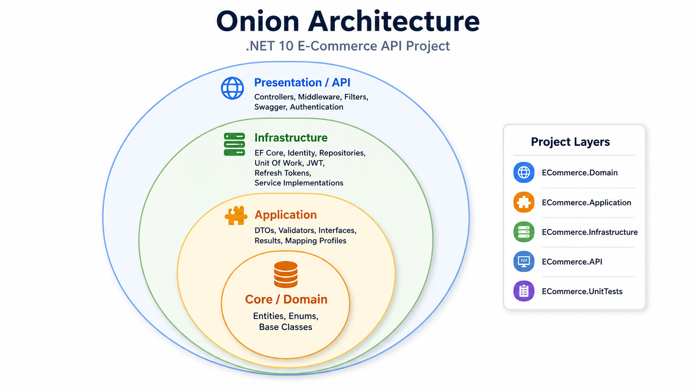
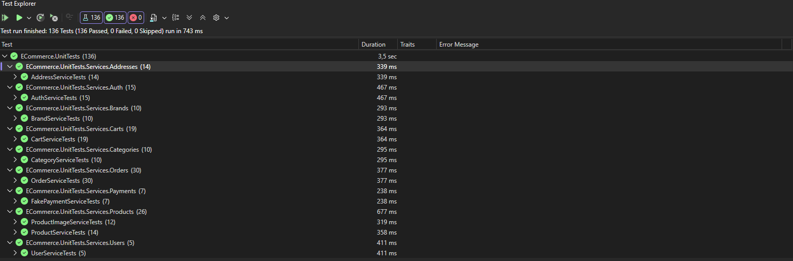
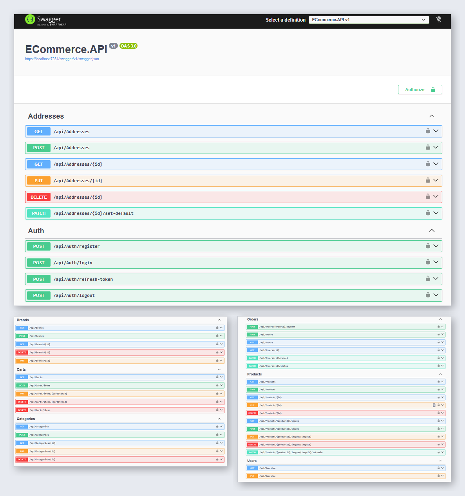

# 🚀 E-Ticaret API — Onion Architecture (.NET 10)

Bu proje, **.NET 10** ve **Onion Architecture** kullanılarak geliştirilmiş, gerçek projelere yakın yapıda bir **RESTful E-Ticaret API** uygulamasıdır.

Amaç; sürdürülebilir, test edilebilir, genişletilebilir ve katmanlı bir backend mimarisi oluşturmaktır.

---

## 📌 Projenin Özellikleri

- ✅ JWT tabanlı kimlik doğrulama
- ✅ Refresh token yenileme ve iptal etme
- ✅ Rol bazlı yetkilendirme (`Admin`, `Customer`)
- ✅ Kullanıcı kayıt, giriş ve profil işlemleri
- ✅ Kategori ve marka yönetimi
- ✅ Ürün ve ürün görseli yönetimi
- ✅ Adres ve varsayılan adres yönetimi
- ✅ Sepet işlemleri
- ✅ Sipariş oluşturma ve durum yönetimi
- ✅ Sipariş sırasında stok düşürme
- ✅ Sipariş iptalinde stok geri yükleme
- ✅ Sahte ödeme servisi
- ✅ Result Pattern
- ✅ FluentValidation
- ✅ Global exception middleware
- ✅ Soft delete ve global query filter
- ✅ Soft delete uyumlu filtreli unique indexler
- ✅ Transaction, commit ve rollback yönetimi
- ✅ Swagger / OpenAPI
- ✅ Uygulama başlangıcında rol seed işlemi
- ✅ **136 başarılı unit test**

---

## 🧱 Proje Mimarisi

Proje **Onion Architecture** prensiplerine göre geliştirilmiştir.



```text
ECommerceAPI
├── ECommerce.Domain
├── ECommerce.Application
├── ECommerce.Infrastructure
├── ECommerce.API
└── ECommerce.UnitTests
```

### 🔹 ECommerce.Domain

Uygulamanın temel domain yapılarını içerir:

- Entity sınıfları
- Enumlar
- Base entity sınıfları
- Auditable entity yapısı
- Identity kullanıcı modeli
- Entity ilişkileri

### 🔹 ECommerce.Application

Uygulama katmanına ait sözleşmeleri ve ortak modelleri içerir:

- Service interface'leri
- Repository interface'leri
- Request ve response DTO'ları
- FluentValidation validator sınıfları
- AutoMapper profilleri
- `Result` ve `ResultT<T>` modelleri
- Uygulama mesajları
- Pagination modelleri

### 🔹 ECommerce.Infrastructure

Teknik implementasyonları içerir:

- Entity Framework Core
- SQL Server
- Repository implementasyonları
- Unit of Work
- ASP.NET Core Identity
- JWT üretimi
- Refresh token işlemleri
- Service implementasyonları
- Sahte ödeme geçidi
- Entity configuration sınıfları
- Migration dosyaları
- Seeder sınıfları

### 🔹 ECommerce.API

HTTP katmanını içerir:

- Controller sınıfları
- Validation filter
- Global exception middleware
- Swagger yapılandırması
- Authentication ve authorization pipeline
- Dependency injection yapılandırmaları

### 🔹 ECommerce.UnitTests

Service katmanına ait unit testleri içerir.

Kullanılan test araçları:

- xUnit
- Moq
- coverlet

---

## 🛠️ Kullanılan Teknolojiler

| Teknoloji | Sürüm |
|---|---:|
| .NET | 10.0 |
| ASP.NET Core | 10.0 |
| Entity Framework Core | 10.0.9 |
| SQL Server Provider | 10.0.9 |
| ASP.NET Core Identity | 10.0.9 |
| JWT Bearer Authentication | 10.0.9 |
| System.IdentityModel.Tokens.Jwt | 8.19.1 |
| AutoMapper DI Extensions | 12.0.0 |
| FluentValidation | 12.1.1 |
| Swagger / Swashbuckle | 10.2.3 |
| xUnit | 2.9.3 |
| Moq | 4.20.72 |
| coverlet.collector | 6.0.4 |

---

## 📦 Modüller

### 🔐 Kimlik Doğrulama

- Kullanıcı kaydı
- Kullanıcı girişi
- Çıkış yapma
- Access token oluşturma
- Refresh token yenileme
- Aktif refresh token iptali
- Customer rolü atama
- Rol ataması başarısız olduğunda kullanıcı kaydını geri alma

### 🗂️ Katalog

- Kategoriler
- Markalar
- Ürünler
- Ürün görselleri
- Ürün aktiflik durumu
- SKU benzersizliği
- Stok yönetimi

### 👤 Kullanıcı ve Adres

- Kullanıcı profilini getirme
- Kullanıcı profilini güncelleme
- Birden fazla adres yönetimi
- Varsayılan adres belirleme
- Varsayılan adres silindiğinde başka bir adresi varsayılan yapma

### 🛒 Sepet

- Kullanıcı sepetini getirme veya oluşturma
- Sepete ürün ekleme
- Sepette bulunan ürünün miktarını artırma
- Ürün miktarını güncelleme
- Sepetten ürün çıkarma
- Sepeti temizleme
- Stok kontrolü
- Ürün toplamı ve sepet toplamı hesaplama

### 📦 Sipariş

- Aktif sepetten sipariş oluşturma
- Adres sahipliği doğrulama
- Ürün aktiflik ve stok kontrolü
- Stok düşürme
- Sipariş verilen ürünleri sepetten temizleme
- Uygun siparişleri iptal etme
- İptal edilen siparişin stoklarını geri yükleme
- Sipariş durumu geçişlerini kontrol etme
- Transaction commit ve rollback

Desteklenen sipariş durumu geçişleri:

```text
Pending   -> Preparing
Pending   -> Cancelled
Preparing -> Shipped
Preparing -> Cancelled
Shipped   -> Delivered
```

### 💳 Ödeme

Proje geliştirme amacıyla sahte bir ödeme geçidi kullanmaktadır.

- Ödeme işlemi
- İptal edilmiş sipariş kontrolü
- Daha önce ödenmiş sipariş kontrolü
- İade edilmiş sipariş kontrolü
- Başarısız ödeme durumunu kaydetme
- Başarısız ödemeyi yeniden deneme
- Başarılı ödemede siparişi ödenmiş olarak işaretleme

---

## ✅ Result Pattern

Beklenen uygulama sonuçları exception yerine `Result` ve `ResultT<T>` modelleriyle döndürülür.

Örnek sonuç türleri:

- Validation
- Not Found
- Conflict
- Unauthorized
- Bad Request
- Success

Beklenmeyen teknik hatalarda exception fırlatılır ve global exception middleware tarafından yönetilir.

---

## 🗑️ Soft Delete

Entity kayıtları `IsDeleted` alanı ve global query filter kullanılarak soft delete yöntemiyle silinir.

Silinen değerlerin tekrar kullanılabildiği alanlarda filtreli unique index kullanılır:

```text
Brands.Name
Categories.Name
CartItems.CartId + ProductId
```

Sistem genelinde kalıcı olarak benzersiz olması gereken alanlar:

```text
Cart.AppUserId
Orders.OrderNumber
Products.SKU
RefreshTokens.Token
```

---

## ⚙️ Gereksinimler

- .NET 10 SDK
- SQL Server, SQL Server Express veya SQL Server LocalDB
- Entity Framework Core CLI
- Git

EF Core CLI kurulumu:

```powershell
dotnet tool install --global dotnet-ef
```

Kurulumu doğrulama:

```powershell
dotnet ef --version
```

---

## 🚀 Kurulum

Projeyi klonlayın:

```bash
git clone <repository-url>
cd ECommerceAPI
```

NuGet paketlerini yükleyin:

```bash
dotnet restore
```

---

## 🔧 Yapılandırma

API, SQL Server bağlantı bilgisini aşağıdaki anahtardan okur:

```text
ConnectionStrings:SqlServer
```

`ECommerce.API/appsettings.Development.json` örneği:

```json
{
  "ConnectionStrings": {
    "SqlServer": "Server=(localdb)\\MSSQLLocalDB;Database=ECommerceDb;Trusted_Connection=True;TrustServerCertificate=True"
  }
}
```

JWT ayarları:

```json
{
  "JwtSettings": {
    "Issuer": "ECommerce.API",
    "Audience": "ECommerce.Client",
    "SecretKey": "uzun-ve-guvenli-bir-secret-key",
    "AccessTokenExpirationMinutes": 15,
    "RefreshTokenExpirationDays": 7
  }
}
```

> Bu proje eğitim ve portföy amacıyla geliştirilmiştir. Gerçek projelerde JWT secret, connection string ve benzeri hassas bilgiler kaynak kodda tutulmamalıdır.

---

## 🗄️ Veritabanı

Migration dosyalarını veritabanına uygulamak için:

```powershell
dotnet ef database update --project ECommerce.Infrastructure --startup-project ECommerce.API
```

Yeni migration oluşturmak için:

```powershell
dotnet ef migrations add MigrationName --project ECommerce.Infrastructure --startup-project ECommerce.API
```

Uygulama başlatıldığında gerekli roller otomatik olarak oluşturulur.

---

## ▶️ Projeyi Çalıştırma

```powershell
dotnet run --project ECommerce.API
```

Swagger yalnızca Development ortamında aktiftir.

```text
https://localhost:<port>/swagger
```

Kullanılan port bilgisi uygulama başlatıldığında terminalde görüntülenir.

---

## 🔄 Uygulama Akışı

```text
Kayıt Ol veya Giriş Yap
          ↓
Access ve Refresh Token Al
          ↓
Adres Oluştur veya Seç
          ↓
Aktif Ürünleri Listele
          ↓
Sepete Ürün Ekle
          ↓
Sipariş Oluştur
          ↓
Ürün Stokları Azaltılır
          ↓
Sepet Ürünleri Temizlenir
          ↓
Sahte Ödeme İşlemini Gerçekleştir
          ↓
Sipariş Durumunu Güncelle
```

---

## 🧪 Testler



Tüm testleri çalıştırmak için:

```powershell
dotnet test
```

Yalnızca unit test projesini çalıştırmak için:

```powershell
dotnet test ECommerce.UnitTests/ECommerce.UnitTests.csproj
```

Güncel test sonucu:

```text
136 / 136 test başarılı
```

Servis bazında test dağılımı:

| Servis | Test Sayısı |
|---|---:|
| CategoryService | 10 |
| BrandService | 10 |
| ProductService | 14 |
| ProductImageService | 12 |
| AddressService | 14 |
| UserService | 5 |
| CartService | 19 |
| FakePaymentService | 7 |
| OrderService | 30 |
| AuthService | 15 |
| **Toplam** | **136** |

Test edilen başlıca senaryolar:

- Başarılı işlemler
- Validation ve business rule hataları
- Repository etkileşimleri
- Unit of Work çağrıları
- Transaction commit ve rollback
- Stok değişiklikleri
- Varsayılan adres yönetimi
- JWT ve refresh token akışları
- Identity kullanıcı oluşturma
- Rol atama işlemleri
- Sepet ve sipariş toplamı hesaplama
- Sipariş durumu geçişleri

---

## 📚 Swagger

Development ortamında Swagger/OpenAPI arayüzü üzerinden endpoint'ler test edilebilir.



Yetkilendirme isteyen endpoint'lerde JWT access token kullanılmalıdır:

```text
Authorization: Bearer <access-token>
```

---

## 👨‍💻 Geliştirici

**Cengizhan Şirin**
